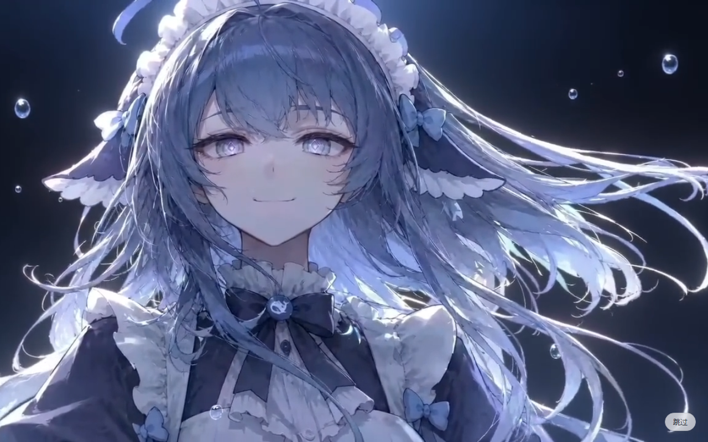
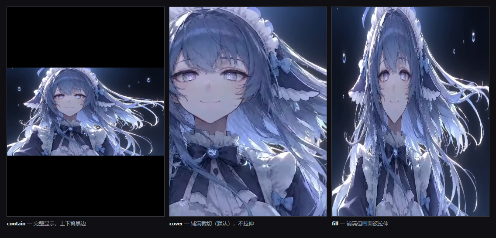

# dsh-splash-animation

给 [DeepSeek Harness](https://github.com/deepseek-ai/deepseek-harness) 加一段**自定义开屏动画**：启动时播放你指定的视频，播完后 0.3 秒渐隐，露出 DSH 界面。

插件自带一段默认视频，**装上就能用**，也可以在设置里换成自己的。



## 推荐安装法

**因为这插件是大肥鱼写的，我也不懂。所以我只推荐直接告诉大肥鱼让她自己安装，以下是提示词**

```
帮我安装一个插件：https://github.com/KDDKBD/DeepSeek-splash-animation

用 plugin_manager 工具执行 install_bundle，target 填：
github:KDDKBD/DeepSeek-splash-animation

装完后告诉我需要重启DSH
```

DSH 会自己改 profile、装依赖并启用插件。这一步需要你批准一次权限提升（插件代码运行在工作区沙箱之外）。

## 普通安装法

**如果上面那条走不通**，用命令行（`dsh` **不随 DSH Desktop 附带**，要先从 npm 装）：

```bash
npm install -g @deepseek-ai/dsh
dsh plugin --profile web add github:KDDKBD/DeepSeek-splash-animation
```

**都不行就手动改配置文件**：编辑
`%APPDATA%\dsh-desktop\harness\profiles\web\package.json`，把依赖加进 `dependencies`、
把 `dsh-splash-animation` 加进 `dsh.profile.bundles`，然后在
`%APPDATA%\dsh-desktop\harness\profiles\web\` 下执行 `pnpm install`
（`pnpm` 可以直接用 `%APPDATA%\dsh-desktop\harness\.desktop-bin\pnpm.cmd`）。

以上方式装完都**重启 DSH** 生效。`--profile web` 是 DSH Desktop 与 `dsh web` 使用的 profile 名称。

卸载：在 **设置 → 插件** 里停用或卸载，或者

```bash
dsh plugin --profile web remove dsh-splash-animation
```

> 界面里的插件市场只接受社区精选列表内的来源，本插件收录之前那里看不到它。
> 通过 GitHub 安装需要本机装有 `git`。

## 使用

装好重启后就有开屏动画，播放的是插件自带的视频。

要换成自己的：打开 **设置 → 插件 → 开屏动画**，点「选择文件…」在弹出的文件框里挑一个视频，点「保存」。也可以直接把路径粘进输入框。

要彻底关掉：在同一个页面点「清除」。

## 行为

| 状态 | 表现 |
|---|---|
| 没设置过 | 播放插件自带的视频 |
| 设置了路径 | 播放该视频。路径无效则**不播放**（不会回退到自带视频），原因显示在设置页 |
| 点过「清除」 | **不播放**，DSH 与未安装插件时一致 |

视频播完会停在最后一帧，然后渐隐消失。默认渐隐 0.3 秒。

## 配置

在 profile 的 `cordis.patch.yml` 里写覆盖项即可调整细节（Windows 上通常是 `%APPDATA%\dsh-desktop\harness\profiles\web\cordis.patch.yml`）：

```yaml
- id: dsh-splash-animation
  config:
    fit: contain      # 完整显示（默认是 cover 铺满裁切）
    muted: false      # 带声音
    fadeOutMs: 600    # 渐隐时长改为 0.6 秒
    skip: click       # 点任意位置跳过
```

| 字段 | 默认 | 说明 |
|---|---|---|
| `src` | 空 | 视频路径。空 = 使用自带视频；清空后不再播放 |
| `fadeOutMs` | `300` | 播完后渐隐的时长（毫秒） |
| `fadeInMs` | `320` | 出现时的淡入时长 |
| `skip` | `button` | 退出方式：`button` 右下角按钮 / `click` 点任意位置 / `auto` 自动 / `never` 不可退出 |
| `skipAfterMs` | `1200` | 仅 `skip: auto` 时有效 |
| `muted` | `true` | 是否静音。默认静音，因为 Chromium 会拦截带声音的自动播放 |
| `volume` | `0.6` | 音量 0–1 |
| `fit` | `cover` | `cover` 铺满裁切（默认，不拉伸，超出部分裁掉）/ `contain` 完整显示、四周留边 / `fill` 拉伸填满 |
| `background` | `#000000` | 画面底色 |
| `playbackRate` | `1` | 播放倍速 0.1–4 |
| `duration` | `0` | 最长播放毫秒数，`0` 表示播放到结束 |
| `maxReplays` | `0` | 重复播放次数 |
| `holdAfterEndMs` | `0` | 播完到开始渐隐之间的停顿 |
| `waitForAppMs` | `2500` | 仅动图使用：动图没有结束事件，只能按时间退出 |

字段填写有误只会退回默认值，不会导致启动失败。

### 画面怎么填满

默认 `fit: cover`：**按比例放大到铺满整个画面，超出的部分裁掉，不拉伸**。视频比窗口更宽就裁两侧，更高就裁上下。

如果素材被裁掉的部分不能少，改成 `fit: contain` 就会完整显示，代价是四周留黑边。



## 支持的格式

视频用 `<video>` 播放：`mp4`、`m4v`、`webm`、`mov`、`mkv`、`ogv`、`ogm`、`mpg`、`mpeg`、`ts`

动图与静态图用 `` 显示：`gif`、`apng`、`webp`、`avif`、`png`、`jpg`、`jpeg`、`svg`、`bmp`、`ico`

**推荐 `webm`(VP9) 或 `mp4`(H.264)**，这两个在所有平台上都能播放。

`mov` 和 `mkv` 只是容器，能否播放取决于内部编码：装 ProRes 或 DNxHD 就无法解码。转码命令：

```bash
ffmpeg -i input.mov -c:v libx264 -crf 20 -pix_fmt yuv420p -movflags +faststart -an opening.mp4
ffmpeg -i input.mov -c:v libvpx-vp9 -crf 32 -b:v 0 -an opening.webm
```

`-movflags +faststart` 把索引移到文件开头，播放器不必下完整个文件就能起播。

## 常见问题

**选了视频但没有播放**
检查设置页是否显示「下次启动播放」，以及 `%APPDATA%\dsh-desktop\harness\dsh-splash-animation\config.json` 里的 `src` 是否正确。设置改动后刷新页面即可生效，不需要重启。

**有画面但没声音**
Chromium 要求用户先与页面交互才允许播放带声音的媒体，而开屏发生在交互之前。插件会自动静音重试，所以画面正常、声音没有。

**启动时还能看到 DSH 自己的小鲸鱼**
那是 Electron 主窗口在 harness 启动前加载的启动画面，插件无法替换。插件负责的是它之后的那一段。

**「选择文件…」没有反应**
对话框在运行 DSH 的机器上弹出，如果你是从另一台机器访问浏览器界面就看不到它，直接手输路径即可。

## 许可

MIT，覆盖插件代码。

`assets/default.mp4` 是示例素材，不属于该授权的范围；二次分发或 fork 时请自行确认素材权利，替换该文件即可换成自己的素材。
